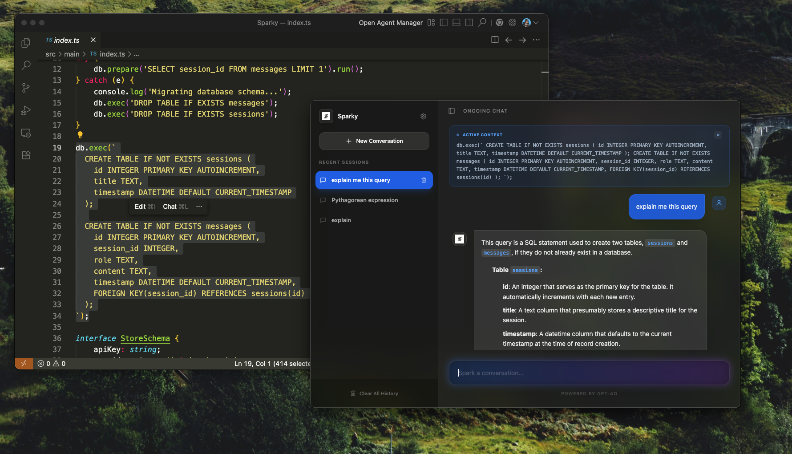

# ⚡️ Sparky

**Sparky** is a lightweight, premium AI assistant for macOS that lives in your floating window. Inspired by tools like Maccy, it allows you to instantly bring context from any app into a chat using a global shortcut.



## ✨ Features

-   **🎯 Instant Context (Control + I)**: Select any text in any macOS app and press `Control + I`. Sparky captures the text automatically and opens a chat prompt with that context pre-loaded.
-   **💎 Premium Aesthetics**: A sleek, translucent, glassmorphism UI built with Tailwind CSS and Framer Motion. Supports macOS vibrancy effects.
-   **🗂 Session Management**: Full chat history support powered by SQLite. Organizes your conversations into sessions with auto-generated titles.
-   **🤖 Powered by GPT-4o Mini**: Fast, intelligent, and cost-effective responses that help you code, write, or research on the fly.
-   **🌓 Always on Top**: A floating panel that follows you across workspaces and stays above your active applications.
-   **📦 Built-in Markdown**: Beautifully rendered code blocks, lists, and formatting for AI responses.

## 🛠 Tech Stack

-   **Core**: [Electron](https://www.electronjs.org/)
-   **Frontend**: [React](https://reactjs.org/) + [TypeScript](https://www.typescriptlang.org/)
-   **Build Tool**: [Vite](https://vitejs.dev/) + [esbuild](https://esbuild.github.io/)
-   **Styling**: [Tailwind CSS](https://tailwindcss.com/) + [Lucide React](https://lucide.dev/)
-   **Animations**: [Framer Motion](https://www.framer.com/motion/)
-   **Database**: [SQLite](https://sqlite.org/) (via `better-sqlite3`)
-   **AI**: [OpenAI API](https://openai.com/)

## 🚀 Getting Started

### Prerequisites

-   Node.js (v18+)
-   macOS (Required for shortcut context capture via AppleScript)
-   An OpenAI API Key

### Installation

1.  Clone the repository:
    ```bash
    git clone https://github.com/yourusername/sparky.git
    cd sparky
    ```

2.  Install dependencies:
    ```bash
    npm install
    ```

3.  Build the project initially:
    ```bash
    npm run build
    ```

### Development

Run the development server with hot-reloading:
```bash
npm run dev
```

### Production Build

Create a macOS `.dmg` or `.app` bundle:
```bash
npm run dist
```

## ⌨️ Usage

-   **Select Text**: Highlight text in any application (Browser, VS Code, Notes, etc.).
-   **Capture**: Press `Control + I`.
-   **Chat**: Ask Sparky anything about the selected text or just start a fresh conversation.
-   **Settings**: Click the gear icon to set your OpenAI API key.

## 🗺 Roadmap

-   [ ] **Multiple Providers**: Integration with Anthropic (Claude), Google Gemini, and local LLMs (Ollama).
-   [ ] **Vision Support**: Screenshot capture to ask questions about UI/images.
-   [ ] **Voice Mode**: Quick voice-to-text input.
-   [ ] **Theming**: Custom accent colors and dark/light mode switching.
-   [ ] **File Support**: Drag and drop files to provide as context.

## 📄 License

MIT License. See `LICENSE` for details.

---
Built with ❤️ by Alchemist
